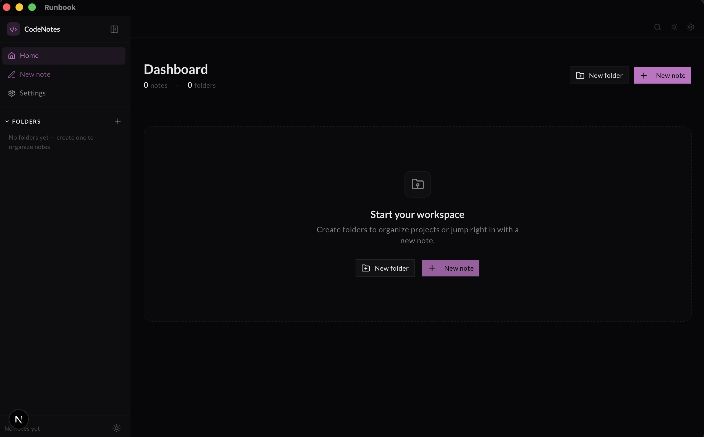
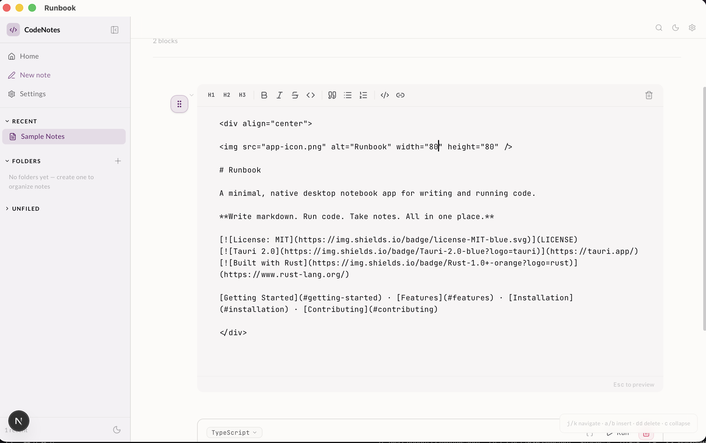
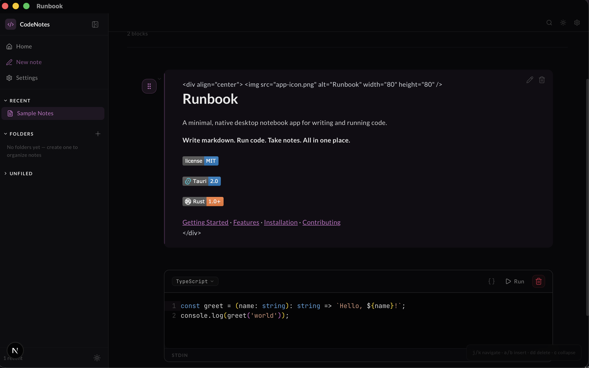

<div align="center">


# Runbook

A minimal, native desktop notebook app for writing and running code.
(Built with Tauri, Rust, and Next.js) - **Tested on macOS for now**

JUST NOTES & CODE. 

**Write markdown. Run code. Take notes. All in one place.**

[](LICENSE)
[](https://tauri.app/)
[](https://www.rust-lang.org/)

[Getting Started](#getting-started) · [Features](#features) · [Installation](#installation) · [Contributing](#contributing)

</div>

---

## Why Runbook?

Most notebook apps are bloated, cloud-dependent, or electron-based. Runbook is different — it's a **lightweight, offline-first** desktop app with a native feel and a tiny footprint (~15 MB). No accounts, no cloud, no Chromium bundled.

Run code in TypeScript, Python, Rust, Bash, and JavaScript directly in your notes. Organize everything with folders. Search across all your notebooks instantly. Back up and restore at any time.

---

## ✨ Features

### 📝 Minimal Notes App
- Clean, distraction-free writing with **Markdown cells** — full GFM support including tables, strikethrough, task lists, and code blocks
- **Auto-save** — your changes are persisted automatically as you type, no manual saving needed
- Organize notebooks into **nested folders** for a tidy workspace

### ▶️ Code Execution
- Write and run code in **TypeScript, JavaScript, Python, Rust, and Bash** — with inline output right below the cell
- Powered by **Monaco Editor** — the same editor that powers VS Code, with syntax highlighting, IntelliSense, and multi-cursor editing
- **Built-in code snippets** for each language to get you started quickly
- **Execution history** — view previous runs of any cell with timestamps

### 🔍 Instant Search
- Search across **all notebooks and cells** instantly with a keyboard shortcut (`Cmd+K` / `Ctrl+K`)
- Results grouped by notebook for quick navigation

### 💾 Backups & Restore
- **Database backup** — snapshot your entire library to a timestamped SQLite file
- **One-click restore** — pick a backup file and restore your full notebook state
- Configure a **custom backup folder** in Settings to keep snapshots where you want them

### 📤 Import & Export
- **Export** any notebook to clean Markdown or standalone HTML
- **Import** existing Markdown files as new notebooks — cells are auto-detected from code blocks and prose sections

### 🌙 Dark & Light Themes
- Follows your system theme automatically, or toggle manually
- Carefully crafted UI with **shadcn/ui** components that look great in both modes

### ⚡ Native Performance
- Built with **Tauri 2.0** — native webview, no bundled Chromium
- ~15 MB bundle size, minimal memory usage
- Fast cold start, low memory usage
- Data stored locally in **SQLite** — no cloud dependency

---

## Screenshots

<!-- <!-- Uncomment when screenshots are ready: -->
<div align="center">
  
  <p><em>Home view — folders, recent notebooks, search</em></p>

  
  <p><em>Notebook editor — code cells with inline output</em></p>

  
  <p><em>Dark mode</em></p>
</div>

---

## Tech Stack

| Layer | Technology |
|---|---|
| Desktop Shell | [Tauri 2.0](https://tauri.app/) (Rust) |
| Frontend | [Next.js 16](https://nextjs.org/) (static export) |
| UI Components | [shadcn/ui](https://ui.shadcn.com/) + [Tailwind CSS v4](https://tailwindcss.com/) |
| Code Editor | [Monaco Editor](https://microsoft.github.io/monaco-editor/) |
| Database | [SQLite](https://www.sqlite.org/) via [rusqlite](https://github.com/rusqlite/rusqlite) |
| Code Execution | Rust `std::process::Command` |
| Package Manager | [Bun](https://bun.sh/) |

---

## Getting Started

### Prerequisites

- [Bun](https://bun.sh/) — JavaScript runtime and package manager
- [Rust](https://www.rust-lang.org/tools/install) — Rust toolchain via `rustup`
- [Tauri Prerequisites](https://tauri.app/start/prerequisites/) — platform-specific system libs

**macOS:**
```bash
xcode-select --install
rustup default stable
```

**Linux (Ubuntu/Debian):**
```bash
sudo apt install libwebkit2gtk-4.1-dev build-essential curl wget file libxdo-dev libssl-dev libayatana-appindicator3-dev librsvg2-dev
```

### Build & Run

```bash
# 1. Clone the repo
git clone https://github.com/tejachundru/runbook.git
cd runbook

# 2. Install dependencies
bun install

# 3. Run in dev mode (with hot-reload)
bun run dev:tauri

# 4. Build for production
bun run build:tauri

# Or build a macOS DMG installer
bun run build:dmg
```

---

## Project Structure

```
runbook/
├── src/                        # Next.js frontend
│   ├── app/                    # App router pages
│   │   ├── page.tsx            # Home — notebook list & folders
│   │   ├── notebooks/          # Notebook editor & creation
│   │   └── settings/           # App settings
│   ├── components/
│   │   ├── home/               # Home page components
│   │   ├── layout/             # App shell, sidebar, header
│   │   ├── notebook/           # Notebook editor & cells
│   │   ├── search/             # Search modal (Cmd+K)
│   │   └── ui/                 # shadcn/ui primitives
│   ├── hooks/                  # React hooks (auto-save, execute, etc.)
│   ├── lib/                    # Tauri wrappers, languages, utils
│   └── types/                  # TypeScript type definitions
├── src-tauri/                  # Rust backend
│   ├── src/
│   │   ├── main.rs             # Entry point, Tauri commands
│   │   ├── db/                 # SQLite database layer
│   │   │   └── schema.sql      # Table definitions
│   │   ├── execute/            # Code execution engine
│   │   └── export/             # Export & import logic
│   ├── Cargo.toml
│   └── tauri.conf.json
├── package.json
└── next.config.ts
```

---

## Data & Configuration

### Data Storage

All data is stored locally — nothing leaves your machine.

| OS | Path |
|---|---|
| **macOS** | `~/Library/Application Support/com.runbook.app/` |
| **Linux** | `~/.local/share/com.runbook.app/` |
| **Windows** | `%APPDATA%\com.runbook.app\` |

### Code Execution Runtimes

> **Yes, Runbook requires local language runtimes to be installed on your machine.** It doesn't bundle any interpreters — it runs your code using whatever you have on your system `PATH`. This means **you control the versions**, and there's zero overhead for languages you don't use.

**Quick install (macOS):**

```bash
# TypeScript / JavaScript
curl -fsSL https://bun.sh/install | bash

# Python
brew install python3

# Rust
curl --proto '=https' --tlsv1.2 -sSf https://sh.rustup.rs | sh

# Go
brew install go

# Bash — already installed on macOS/Linux
```

**Supported languages and their runtime requirements:**

| Language | Required Runtime | Install |
|---|---|---|
| TypeScript | [Bun](https://bun.sh/), `tsx`, or `ts-node` | `curl -fsSL https://bun.sh/install \| bash` |
| JavaScript | [Bun](https://bun.sh/) or [Node.js](https://nodejs.org/) | `brew install node` |
| Python | `python3` or `python` | `brew install python3` |
| Rust | `rustc` (via [rustup](https://rustup.rs/)) | `curl --proto '=https' --tlsv1.2 -sSf https://sh.rustup.rs \| sh` |
| Go | `go` | `brew install go` |
| Bash / Shell | `bash` or `sh` | Pre-installed on macOS/Linux |

> **macOS tip:** Tauri apps may not inherit your shell's `PATH`. If a runtime isn't found, try launching from the terminal: `open -a Runbook` or `bun run dev:tauri`.

### Settings

Configure in **Settings** (gear icon in sidebar):

- **Execution timeout** — how long code cells are allowed to run (default: 30s)
- **Backup folder** — custom directory for database snapshots

---

## Adding a New Language

Runbook is designed to be extensible. Adding a new language requires changes in **two places** — the Rust backend (executor) and the TypeScript frontend (language config).

### 1. Add the executor (Rust backend)

Edit `src-tauri/src/execute/mod.rs`:

```rust
// 1. Add a runtime resolver (uses OnceLock for caching)
fn mylang_runtime() -> Option<&'static PathBuf> {
    static ML: OnceLock<Option<PathBuf>> = OnceLock::new();
    ML.get_or_init(|| resolve_any(&["mylang"])).as_ref()
}

// 2. Add an executor function
pub fn execute_mylang(code: &str, timeout_ms: u64) -> ExecuteResult {
    let Some(runtime) = mylang_runtime() else {
        return missing_runtime("mylang");
    };

    let mut tmp = tempfile::Builder::new()
        .prefix("nb-")
        .suffix(".mylang")
        .tempfile()
        .unwrap();
    tmp.write_all(code.as_bytes()).unwrap();

    let path = tmp.path().to_path_buf();
    let result = run_command(Command::new(runtime).arg(&path), timeout_ms);
    drop(tmp);
    result
}

// 3. Register in the dispatch table
pub fn execute_code(language: &str, code: &str, timeout_ms: u64) -> ExecuteResult {
    match language {
        // ... existing languages ...
        "mylang" => execute_mylang(code, timeout_ms),
        _ => ExecuteResult { /* unsupported */ }
    }
}
```

### 2. Add the language config (TypeScript frontend)

Edit `src/lib/languages.ts`:

```typescript
{
  id: "mylang",            // must match the Rust dispatch key
  label: "My Language",
  monacoLang: "typescript", // Monaco editor language for syntax highlighting
  fileExt: "mylang",
  defaultCode: `print("hello world");`,
  snippets: [
    { name: "Hello", code: `print("hello from MyLang!");` },
  ],
}
```

That's it — no database migrations, no IPC changes needed. The language ID flows from the frontend → Tauri command → Rust executor.

### Architecture Overview

```
┌─────────────────────────────────────────────────────────┐
│  Frontend (Next.js)                                      │
│                                                          │
│  languages.ts ──► NotebookEditor ──► useExecute hook     │
│        │                      │                          │
│   language id            language id + code              │
│   snippets          ─────────────────────────►           │
│                                                          │
├────────────────────── Tauri IPC ─────────────────────────┤
│                                                          │
│  Backend (Rust)                                          │
│                                                          │
│  execute_code(language, code, timeout)                   │
│       │                                                  │
│       ├── resolve runtime binary via PATH                │
│       ├── write code to temp file                        │
│       ├── spawn process with timeout                     │
│       └── return stdout / stderr / exit code             │
│                                                          │
└─────────────────────────────────────────────────────────┘
```

---

## Scripts

| Command | Description |
|---|---|
| `bun run dev` | Start Next.js dev server (browser only) |
| `bun run dev:tauri` | Start Tauri dev mode (native window + hot-reload) |
| `bun run build` | Build Next.js static export |
| `bun run build:tauri` | Build production Tauri app |
| `bun run build:dmg` | Build macOS DMG installer |
| `bun run lint` | Run Biome linter |
| `bun run format` | Format code with Biome |

---

## Contributing

Contributions are welcome! Here's how to get started:

### Setup

1. **Fork** the repository
2. Clone your fork: `git clone https://github.com/<your-username>/runbook.git`
3. Install deps: `bun install`
4. Run dev: `bun run dev:tauri`
5. Make your changes in a **feature branch** (`git checkout -b feature/my-feature`)
6. Run the linter: `bun run lint`
7. Open a **Pull Request**

### Areas to Contribute

- **New language support** — see [Adding a New Language](#adding-a-new-language)
- **UI improvements** — the frontend is standard Next.js + shadcn/ui
- **Bug fixes** — check the [Issues](https://github.com/tejachundru/runbook/issues) tab
- **Documentation** — improve README, add guides, fix typos
- **Platform support** — help with Windows or Linux testing

---

## License

This project is licensed under the [MIT License](LICENSE).
